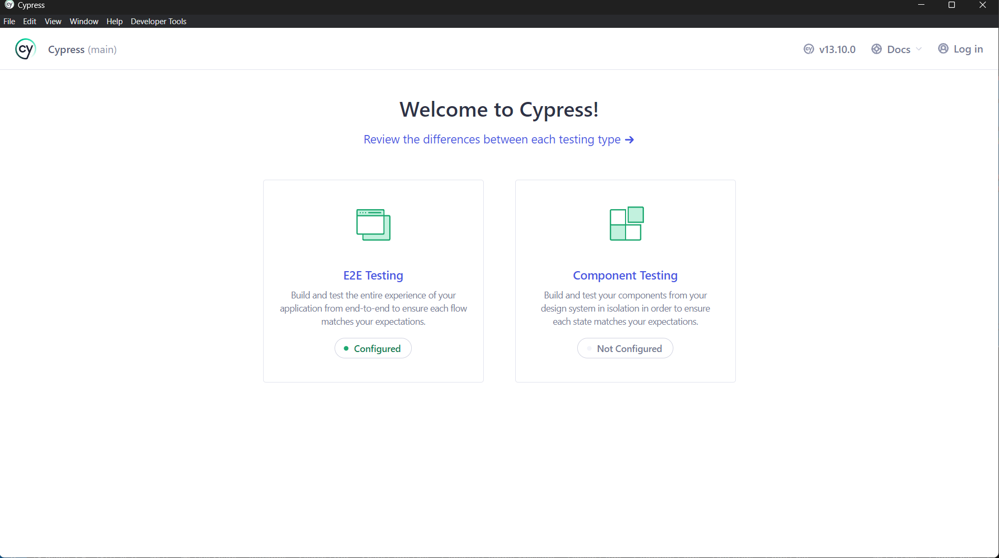
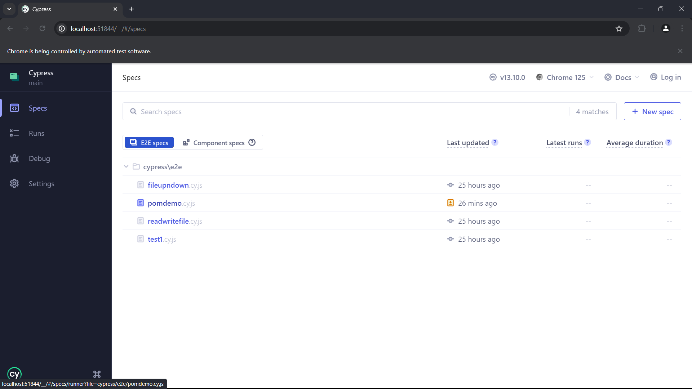
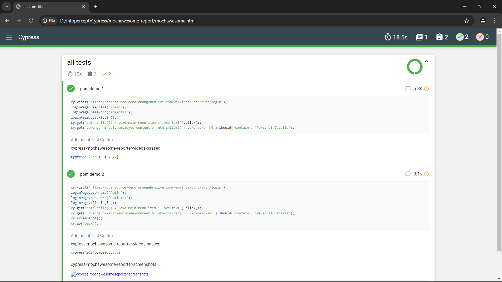

# Cypress

Cypress is a frontend test automation tool for regression testing of web applications.


## Prerequisites 

Node version 20.x or above should be installed
## Installation

Install cypress with npm

```cli
npm install cypress --save-dev
```
    

## GUI

Cypress has a gui app which can be used to run test and debug errors

To open it run 
```
npx cypress open
```



## Execute tests

We can execute test files from the cypress gui or throught the command line

```npx cypress run``` will execute all the tests in the test folder

We can specify the file to be executed by appending –s followed by the file path in command line

```
npx cypress run -s example.cy.js
```
## Tests

In cypress, it block is used to write Tests

The It block takes two parameters, first is a string for the naming of the test

The second parameter is a function, similar to playwright

```
it('test name', () => {
    cy.visit('...')
})
```
These test file are written in e2e folder inside the project folder

## Assertions

Cypress bundles the popular Chai assertion library, as well as helpful extensions for Sinon and jQuery

There are two types of assertions in cypress

1. Implicit Assertions

- Implicit assertions use .should() function

- It takes two parameter, first being the method as a string, and the second being the value to compare

Example:
```
.should('not.equal', 'Jane')
```

2. Explicit Assertions

- Explicit assertions use the method .expect

Example: 
```
.expect(name).to.not.equal('Jane')
```

## Video and Screenshot

Cypress provides video and screenshot functionality 

`cy.screenshot()` function will take a screenshot at that time of execution

We can configure cypress.config.js file to make a video everytime a test is executed by setting `video: true,` in the e2e object inside cypress.config.js

## Page Object Model

Page objects are intended to make end-to-end tests readable and easy to maintain.

```
import { Login } from './pages/login'

const loginPage = new Login()


it('POM Demo', () => {
    cy.visit('https://opensource-demo.orangehrmlive.com/web/index.php/auth/login')
    loginPage.username('Admin')
    loginPage.password('admin123')
    loginPage.clicklogin()
    cy.get(':nth-child(6) > .oxd-main-menu-item > .oxd-text').click()
    cy.get('.orangehrm-edit-employee-content > :nth-child(1) > .oxd-text--h6')
        .should('contain', 'Personal Details')
})
```

```
export class Login{
    
    username_textbox = ':nth-child(2) > .oxd-input-group > :nth-child(2) > .oxd-input'
    pword_textbox = ':nth-child(3) > .oxd-input-group > :nth-child(2) > .oxd-input'
    login_button = '.oxd-button'

    username(uname){
        cy.get(this.username_textbox)
        .type(uname)
    }
    password(pword){
        cy.get(this.pword_textbox)
        .type(pword)
    }
    clicklogin(){
        cy.get(this.login_button).click()
    }

}
```
## Download File

Cypress provides support to upload and download file during its execution

To use this feature first install its download file module

Run the following command in the terminal
```
npm install cypress-downloadfile
```
And add the following code to the command.js file inside the support folder
```
require('cypress-downloadfile/lib/downloadFileCommand')
```
Configure the cypress.config.js file as following
```
const { defineConfig } = require('cypress')
const {downloadFile} = require('cypress-downloadfile/lib/addPlugin')

module.exports = defineConfig({
  // setupNodeEvents can be defined in either
  // the e2e or component configuration
  e2e: {
    setupNodeEvents(on, config) {
         on('task', {downloadFile})
      })
    }
  }
})
```
Example of basic command
```
cy.downloadFile('https://upload.wikimedia.org/wikipedia/en/a/a9/Example.jpg','mydownloads','example.jpg')
```

## Upload File

The package is distributed via npm and should be installed as one of your project's `devDependencies`:

```
npm install --save-dev cypress-file-upload
```
Configure the `command.js` file as following
```
import 'cypress-file-upload';
```
Example of basic command
```
cy.get('[data-cy="file-input"]')
  .attachFile(['myfixture1.json', 'myfixture2.json']);
```
## HTML Report

We can use mochawesome reporter plugin to export the test result as a HTML code

Firstly install cypress-mochawesome-reporter
```
npm i --save-dev cypress-mochawesome-reporter
```

Configure the cypress.config.js file
```
const { defineConfig } = require('cypress');

module.exports = defineConfig({
  reporter: 'cypress-mochawesome-reporter',
  e2e: {
    setupNodeEvents(on, config) {
      require('cypress-mochawesome-reporter/plugin')(on);
    },
  },
});
```
Lastly add import in e2e.js
```
import 'cypress-mochawesome-reporter/register';
```
